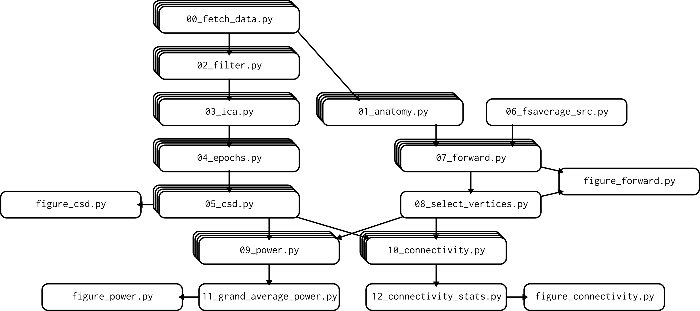

# Structuring Code and Data

- [Slides](https://github.com/patrickmineault/research_code/tree/main/docs/slides)

## Intro - Good research code

- Patrick Mineautl

Is my code fast? no. But is it well document? no. but does it work? also no.

- [Software Carpentries](https://software-carpentry.org/)

- 5-minute action items

- [Code and working memory in the brain, Ivanova et al. (2020)](https://elifesciences.org/articles/58906): Coding is more working memory intensive than a language problem per se.
    - Strong activation in the PPA: Python Parsing Area XD
    - Simple is better than complex. Complex is better than complicated.
- Research code is very LTM-intensive
    - Create data &rarr; transform data &rarr; fit models &rarr; Test Hypotheses &rarr; Create data.
    - Create data &rarr; transform data &rarr; fit models &rarr; Test Hypotheses &rarr; Generate plots &rarr; Write and publish paper.
- Kernighan's Law: Debugging is twice as hard as writing the code in the first place. Therefore, if you write the code as cleverly as possible, you are, by definition, not smart enough to debug it.

- Project folder structure templates:
    - Turing Way
    - Research Software Engineering with Python
    - Data science cookiecutter
    - Shablona

- `pip install -e .`
    - code inside the special folder (e.g. placeholder: shablona) becomes a package (e.g. shablona)
    - `-e`: editable/development mode: code is not packed but symlinked, so changes to that package is propagated across other packages.
    - [Further reading, click me!](https://github.com/patrickmineault/research_code/blob/main/docs/notes/how_packages_work.md)

- [python duecredit](https://github.com/duecredit/duecredit)

- Conventions
    - Notebooks &rarr; `Start with a Capital Letter and Using Spaces as Separators.ipynb`
    - Reusable functions and packages, etc &rarr; `snake_case.py`
    - Tests under `test` folder
- Organizing scripts
    - [Van Vliet (2020)](https://journals.plos.org/ploscompbiol/article?id=10.1371/journal.pcbi.1007358) Dependency Graph
    - 
    - Use filenames that indicate hierarchy, e.g. `s00_fetch_data.py`
    - Figure code separate from processing steps code, e.g., `figure_csd.py`
    - Use a master script to bind everything together, e.g., plain Python, bash files, build tools like `doit` and `make`, or specialized tools like `nipype`.

- Idea: Create a class from a script.

- Notebooks
    - [I don't like notebooks by Joel Grus](https://www.youtube.com/watch?v=7jiPeIFXb6U)

## Decouple
- Spaghetti Code: an undocumented piece of software source code that cannot be extended or modified without extreme difficult due to its convoluted structure.
- Separation of concerns
    - data loading function should just load data.
    - separate small boxes (~80 columns, 50 lines) with minimal interface.
- Pure function: don't have side effects, e.g. changing multable objects that are passed by references, i.e., don't create a copy in memory.
    - A nice example is `sort` and `sorted`.
    - You can use closure or classes to encapsulate state.
- Better idiomatics
    - `f-string`
    - using "magic" column numbers in a raw `numpy array` rather than named columns in `pandas`
    - using unnamed dimensions in numpy rather than `xarray`
    - Read other people's code and join open-source projects to learn idioms from the language.

- Keep your configuration our of your code
    - Use `argparse` to specify options via the comand line
    - Keep configuration options located in an importable `config.py` file
    - Use `python-dotenv` to store secrets in a `.env` file

## Centered Kernel Alignment (CKA)
* Q: How can we compare different brain areas and ANNs representations?
* A: Choose a standard battery of stimuli, measure responses across systems, compare the responses.
* Approaches:
    * Forward encoding models (e.g., ridge regression)
    * Canonical Correlation Analysis (CCA)
    * Representational Similiary Analysis (RSA)
    * Centered Kernel Alignment (CKA)^[1]

[1] [There is an implementation in a notebook from authors](https://colab.research.google.com/github/google-research/google-research/blob/master/representation_similarity/Demo.ipynb)

## Testing

- If the error is for the user, through an error, if the error is for the developer, through an assert.
- Hide the test-assert in `if __name__ == '__main'":`, i.e., run the script means run the testsuite.
- `assert` is great for inline tests, e.g., check wheter the shape of a matrix is correct aafter a permute operation.
- use a testsuite like `unittest` or `pytest` to create a specialized file with tests that run with the help of a runner
- use `nose2` to run all tests within a directory- use `Coverage.py` package to figure out your test coverage.
    - code coverage is the percentage of lines of code called by the tests.
- Do code refactory in the weekends! Low pressure!

## Misc

* Premature optimization is the root of all evil in Computer Science: performance is not an issue in the begging. That applies to plotting as well!

* Instead to ask to somebody to answer, ask then to speculate.
* code memoization: make code faster.
